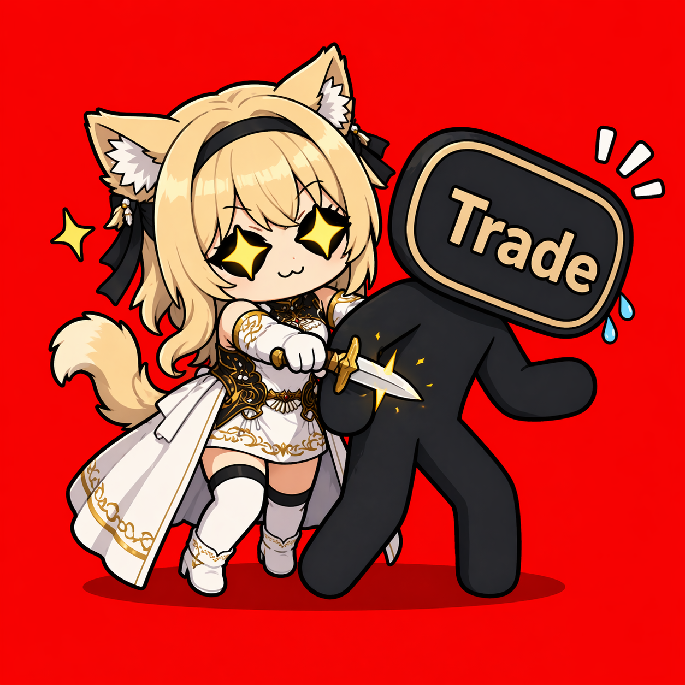

  

<h1 align="center">Backstab The Trade</h1>

Free your mouse and fingers from repetitive trading.

Backstab The Trade is a Dalamud plugin that assists player for repeated gil or item trades.

Backstab The Trade currently supports the English client.Support for Japanese and Chinese users is planned for a future version.

## Features

Backstab The Trade includes three payer modes and one receiver mode.

### Payer Modes

#### Gil Trade Mode

Enter the amount of gil you want to trade. The plugin will build a trade plan and help
you process the trade.

#### Item Manual Mode

Enter the quantity of items you want to trade to the receiver. The plugin will build a
trade plan from your inventory and help process the trade.

#### Gil to Item Trade Mode

Enter the amount of gil you want to pay to the receiver. The plugin will build a trade
plan using inventory items with a total value close to that gil amount, then help
process the trade.

### Receiver Mode

Receiver Mode can automatically press `Trade` in the trade window and press `Yes` in the
confirmation window while you are receiving a trade.

### Event Tracker

- Useful for debug and testing
- Tracks the most recent 50 trade records

### Time Settings

Time Settings let you adjust trade timing to better match your game client, network
conditions, or testing needs.

## Usage

### Payer

1. Target a player and right-click the player, then press the `Backstab The Trade` to open the plugin.
2. Select the mode you want to use.
3. Enter the gil amount or item quantity you want to trade.
4. Confirm the target player.
5. Press `Auto Start`.
6. The plugin will process the trade automatically.

### Receiver

1. Open Backstab The Trade.
2. Click the button to unlock Receiver Mode.
3. Enable the Receiver Mode checkbox.
4. The plugin will automatically press `Trade` in the trade window and `Yes` in the confirmation window.

## Installation

1. Type `/xlsettings` in the in-game chat to open the Dalamud settings window.
2. Go to the `Experimental` tab.
3. Copy your custom plugin repository link and paste it into the available text input field.
4. Search for `Backstab The Trade` and install it.

## Support and Help

Backstab The Trade is still in development, so some issues are expected. The Event Tracker and trade history can help capture useful debug information. 

Feel free to report problems, share feedback, or send logs when needed.

If you run into issues, you can also join the [Discord](https://discord.gg/bxuPSWxwm) and report them.

## Donation

Donations are appreciated, and you can support development here:

[Ko-fi](https://ko-fi.com/ray_cr#)

Donations are completely optional, and the plugin is free to use for everyone.

## License

This project is released under the GNU General Public License v3.0 (`GPL-3.0`).
